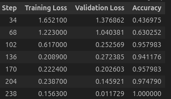
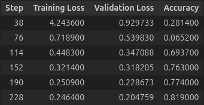
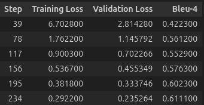

# 项目简介
## 工作流
本项目实现了多任务PDF问答, 由以下核心功能组成整个工作流:
- PDF->关系型数据库的预处理
- 用户意图识别
- 问题路由
- 问题关键词抽取
- 自然语言转SQL
- 文档召回
- 大模型生成回答
- 回答评估

## 微调前后评分对比
### 模型微调前
直接使用Qwen2.5-3B-Instruct模型，不进行任何微调的情况下推理，评估结果如下:
```
{
    "1-1": 46.9914,
    "1-2": 44.0396,
    "2-1": 21.6003,
    "2-2": 85.5529,
    "3-1": 68.9933,
    "3-2": 86.4218,
    "final_score": 57.5261
}
```

### 模型微调后
使用bert、Qwen2.5-3B-Instruct的微调后模型推理，评估结果如下:
```
{
    "1-1": 90.3522,
    "1-2": 90.792,
    "2-1": 95.6968,
    "2-2": 85.5246,
    "3-1": 71.3721,
    "3-2": 87.1286,
    "final_score": 86.4032
}
```


## 模型说明
本项目基于开源模型进行了私有数据微调，以满足关键节点的推理需要, 具体如下:

### 用户意图识别
- 基座: https://modelscope.cn/models/tiansz/bert-base-chinese
- 微调后: https://modelscope.cn/models/Blackoutta/bert-base-chinese-sft-intention
- 选型理由: 分类任务需要较强的上下文理解能力，所以选用了encoder-decoder架构的bert模型。同时它也体积小，训练时间短，易于开发测试
- 模型训练结果: 以Accuracy作为评估指标，在dev集上达到了100%命中效果(dev集为原数据集中采样的10%)




### 关键词抽取
- 基座: https://modelscope.cn/models/Qwen/Qwen2.5-3B-Instruct
- 微调后: https://modelscope.cn/models/Blackoutta/Qwen2.5-3B-Instruct-sft-keyword-lora
- 选型理由: 
    - 选择了qwen2.5-3B-Instruct作为基座，本身拥有多任务指令跟随能力，降低了微调所需数据量要求
    - 3B尺寸无需量化即可单卡训练(24G或32G显存)，方开发测试
    - 选择lora作为微调方式，一是因为它是重参数化微调，不额外增加模型大小; 二是可以更好地支持vllm推理框架。
- 模型训练结果: 以Accuracy作为评估指标，在dev集上达到了81.9%命中效果(dev集为原数据集中采样的10%)




### 自然语言转SQL
- 基座: https://modelscope.cn/models/Qwen/Qwen2.5-3B-Instruct
- 微调后: https://modelscope.cn/models/Blackoutta/Qwen2.5-3B-Instruct-sft-nl2sql-lora
- 选型理由: 同上
- 模型训练结果: 以Bleu-4作为评估指标，在dev集上达到了61%的分数(dev集为原数据集中采样的10%)



## 项目结构
```
.
├── 1-preprocess_pdf.py         # 主程序1：预处理PDF数据
├── 2-infer_and_evaluate.py     # 主程序2: 推理并评估
├── dataloader                  # 数据加载器，用于加载各种中间数据，被其他模块调用
│   ├── dataloader.py
├── evaluator                   # 评估器，用于评估推理结果
│   ├── datatypes.py
│   ├── evaluator.py
│   ├── type_1_1.py
│   ├── type_1_2.py
│   ├── type_2_1.py
│   ├── type_2_2.py
│   ├── type_3_1.py
│   └── type_3_2.py
├── inferencer                  # 推理器，所有与模型的交互都封装在这里
│   ├── _answer_generator.py
│   ├── _answer_generator_sql.py
│   ├── _answer_generator_type1.py
│   ├── _answer_generator_type2.py
│   ├── _answer_generator_type3.py
│   ├── _answer_generator_util.py
│   ├── _hf_model.py
│   ├── inferencer.py
│   ├── _model.py
│   ├── _prompt.py
├── preprocess                  # 预处理模块，用于将PDF转换为关系型数据
│   ├── _browser.py
│   ├── _checker.py
│   ├── example
│   ├── _extractors.py
│   ├── notes.md
│   ├── _pdf2txt.py
│   ├── _pdf_util.py
│   ├── preprocessor.py
│   ├── _table_builder.py
│   ├── _table_builder_util.py
│   ├── xpdf
│   └── xpdf-tools-linux-4.05
├── resources                   # 存放各类项目所需资源
│   ├── dataset                 # 数据集
│   ├── metrics                 # 测试集
│   ├── model_download          # 模型下载脚本
│   ├── evaluated               # 评估结果(自动生成)
│   ├── inferenced              # 推理中间结果(自动生成)
│   ├── processed_data          # 预处理后的数据(自动生成)
│   └── sft_models              # 微调后的模型checkpoint存放点(自动生成)
└── sft
    ├── bert_cls_inference.ipynb       # bert分类模型推理测试notebook
    ├── bert_cls_training.ipynb        # bert分类模型训练notebook
    ├── qwen_keyword_inference.ipynb   # qwen关键词抽取模型推理测试notebook
    ├── qwen_keyword_training.ipynb    # qwen关键词抽取模型训练notebook
    ├── qwen_nl2sql_training.ipynb     # qwen自然语言转SQL模型训练notebook
    ├── diverge_data_cls_a.py          # 分类数据集平衡脚本(针对A类)
    ├── diverge_data_cls_b.py          # 分类数据集平衡脚本(针对B类)
    ├── split_cls_dataset.py           # 分类数据集train/dev划分脚本
    ├── split_keyword_dataset.py       # 关键词抽取数据集train/dev划分脚本
    └── split_nl2sql_dataset.py        # 自然语言转SQL数据集train/dev划分脚本
    ├── metrics.py                     # 评估指标封装
```